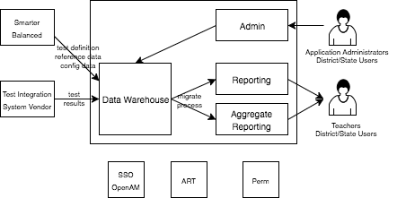
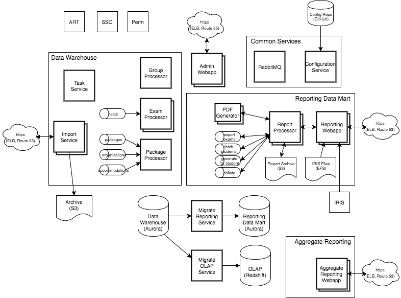

## Architecture 

**Intended Audience**: This document describes the overall architecture of the [Reporting Data Warehouse](../README.md) (RDW). It includes a discussion of the various applications, data flow, deployment philosophy, etc. Anybody interested in developing, deploying or maintaining the RDW project may find it useful. That includes developers, operations, system administrators.

### Overview

The RDW is divided into sub-systems based on data, performance and scalability requirements. These include:

* **Data Warehouse**. This is where data enters the system. It is the collection of all assessment definitions, institutions, students, student groups, and test results. It includes supplemental reference data such as subject claims and traits, common core standards, accessibility/accommodation codes and descriptions, ethnicities, and grades.
* **Reporting**. This is the main reporting data mart and web UI. The test results have been optimized for presentation to teachers and administrators to allow them to quickly view results. It includes *all* test results (summative, interim comprehensive and assessment blocks).
* **Aggregate Reporting**. This is the system for viewing test results through the lens of aggregation, trends, etc. The test results have been optimized for slicing and dicing. It is limited to summative and interim comprehensive tests (no aggregation is done for interim assessment blocks).
* **Admin**. This is the system for performing application administrative tasks such as uploading student groups, configuring assessment subjects, embargoing/releasing test results, etc. 

The RDW uses other systems from the SBAC Open Test System environment, including:

* **OpenAM** for OAuth2 and Single Sign On (SSO).
* **ART** for management of users (teachers and administrators) and institutions (schools and districts).
* **Perm** service for management of roles and permissions for the reporting component.
* **IRIS** for displaying test items as the students see them, as well as for looking up rubric and example data.

### Applications

To make deployment easier, all the RDW applications have been containerized. The orchestration of the applications is handled with Kubernetes. The current deployment is in **AWS** so kops is used to configure the many resources needed by the cluster.

The deployment takes advantage of the AWS ecosystem including the following technologies:

* **Aurora**. High performance Amazon version of MySQL. Backs both the data warehouse and the reporting data mart.
* **Redshift**. Amazon OLAP database.
* **ElastiCache**. Redis-compatible memory cache used by the web apps to cache user session information.
* **S3**. Reliable, long-term storage used to archive all data that enters the system.
* **ELB**, **Route 53**, **Certificate Manager** for load balancing, routing and SSL termination.

Here is an overview of the RDW processes:

*The* ***bold*** *boxes represent services that are deployed as kubernetes deployments; multiple boxes represent horizontally scalable processes with replicas > 1. Most of the data flow lines have not been included to avoid making the diagram unreadable.*

**RabbitMQ**. The message queue is an infrastructure service (like the database or config repository). However it is deployed in a container as part of the cluster so it is called out here. Note that the queue is not used as the sole storage for any critical data so an HA configuration is good for system reliability but not necessary for data integrity.

**Configuration Service**. This is the central configuration service that all the applications use to get their settings.

**[Import Service](Runbook.md#import-service)**. This service is the REST end-point for getting data into the system. It is responsible for archiving all imported data and then passing the work, via message queue, to back-end processors. It uses OAuth2 for client validation. It is horizontally scalable for HA and overall throughput. A single process can handle a few dozen clients with an average latency of 200-300ms per request.  

**[Package Processor](Runbook.md#package-processor)**. This processor handles data that is less frequently ingested: assessment packages, organizations (schools and districts), and accommodations. It is responsible for parsing and validating the data before writing it to the data warehouse. Due to infrequent demand this processor has not been designed for high concurrency and only a single instance should be run.

**[Exam Processor](Runbook.md#exam-processor)**. This processor handles parsing, validating and writing test results to the data warehouse. It is horizontally scalable with each process handling 20-30 exams/sec. 

**[Group Processor](Runbook.md#group-processor)**. This processor handles parsing, validating and writing student group information to the data warehouse. It is horizontally scalable but a single process can handle a large volume of data, and group changes are relatively infrequent.

**[Migrate Reporting Service](Runbook.md#migrate-reporting)**. This service is responsible for keeping the reporting data mart up to date with the data warehouse. It watches the data warehouse for changes and copies any changes that affect reporting. Changes are migrate "immediately", within a few minutes. Only a single instance can be run since data changes must be handled serially. A single instance can migrate 140+ exams/second.

**[Migrate OLAP Service](Runbook.md#migrate-olap)**. This service is responsible for keeping the aggregate reporting OLAP database up to date with the data warehouse. It watches the data warehouse for changes and copies any changes that affect aggregate reporting. Changes are migrated daily. Only a single instance can be run since data changes must be handled serially. A single instance can migrate >1.5 million exams/hour.

**[Task Service](Runbook.md#task-service)**. This service is responsible for executing scheduled tasks. Currently this includes:
* Synchronizing organization data from ART (daily).
* Generating an import reconciliation report (daily).
* Resubmitting unprocessed data (daily).
Only a single instance should be run since the task execution uses a simple, uncoordinated, time-based strategy.

**[Reporting Web App](Runbook.md#reporting-webapp)**. This is the main reporting web application used by customers. It is horizontally scalable with each process handling 2000-3000 concurrent users (this deployment is expected to have up to 15000 concurrent users). 

**[Reporting Service](Runbook.md#reporting-service)**. This service provides the back-end API for reports against the reporting data mart, i.e. individual test results. It is horizontally scalable and many instances should be run to deal with report requests from the webapp.

**[Aggregate Service](Runbook.md#aggregate-service)**. This service provides the back-end API for reports against the OLAP data store, i.e. aggregate reports. It is horizontally scalable; however, the OLAP data store is typically the bottleneck and running many instances of this service may not result in better overall throughput.

**[Admin Service](Runbook.md#admin-service)**. This service provides the back-end API for administrative functionality including management of student groups, instructional resource links, embargo settings. It is horizontally scalable, however administrative management is limited in scope and a single instance is usually sufficient.

**[Report Processor](Runbook.md#report-processor)**. This processor generates PDF reports. It is horizontally scalable and many instances should be run to deal with reporting load.  

**[PDF Generator](Runbook.md#pdf-generator)**. This application converts HTML to PDF. It is used by the report processor. It is horizontally scalable and many instances should be run to deal with reporting load. 