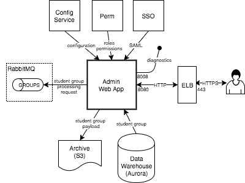

# Runbook

**Intended Audience**: the runbook describes behavior and configuration options of the various applications in the [Reporting Data Warehouse](../README.md) (RDW). Operations, system administration, developers, and tier 3 support may find it useful.

**TODO - rabbitmq?**

**TODO - configuration server?**

### Table of Contents

1. [Common Conventions](#common)
1. [Import Service](#import-service)
1. [Package Processor](#package-processor)
1. [Exam Processor](#exam-processor)
1. [Group Processor](#group-processor)
1. [Migrate Reporting](#migrate-reporting)
1. [Migrate OLAP](#migrate-olap)
1. [Task Service](#task-service)
1. [Reporting Web App](#reporting-webapp)
1. [Report Processor](#report-processor)
1. [PDF Generator](#pdf-generator)
1. [Admin Web App](#admin-webapp)

### Other Resources

1. [Import and Migrate](Runbook.migrate.md)
1. [Language Support](Runbook.language.md)

<a name="common"></a>
## Common Service Conventions
All the applications in the RDW share common conventions and behaviors. This consistency across services makes maintaining the system less prone to error.

* **Dockerized**. They have been built to run in containers managed by an orchestration framework like Kubernetes.  
* **Java 8**. (non-issue since JDK is part of the docker image?)
* **Spring Boot**. 
    * [Configuration][1] and [Common Properties][2]. 
    * [Actuator end-points][3]. 
    * Logging. 
    * what else? 
* 

#### Configuration
As [Spring Boot][1] applications, the configuration settings for all applications come from:

* **Built-in defaults**. All applications have built-in defaults for everything except secrets (e.g. credentials).
* **Environment variables**. These may be used to override any default setting. However, they are used primarily to configure the environment profile and configuration server settings.
* **Command Line Options**. These may be used to override any default setting. In a container orchestration framework, these are seldom used.
* **Configuration server**. There is a central configuration server that all applications use to get environment-specific settings. Properties served up by the configuration server may be encrypted, protecting environment secrets. 

There are settings that all the applications use to bootstrap to the configuration server. These are generally set using environment variables in the orchestration framwork, for example: 

```bash
CONFIG_SERVICE_ENABLED=true
CONFIG_SERVICE_LABEL=master
CONFIG_SERVICE_URL=http://configuration-service
```

**TODO - document how to encrypt secrets and use them in configuration**

**TODO - ?document how `spring.profiles` can be used with configuration server?**


<a name="import-service"></a>
## Import Service
The import service is the REST end-point for submitting data to the system. It is responsible for archiving all imported data and then passing the work, via message queue, to payload processors. It uses OAuth2 for client validation. It is horizontally scalable for HA and overall throughput. A single process can handle a few dozen clients with an average latency of 200-300ms per request. 


#### Configuration
The [Annotated Configuration](../config/rdw-ingest-import-service.yml) describes the properties and their effects.


<a name="package-processor"></a>
## Package Processor
The package processor processes assessment packages, organizations and accommodations submitted to the system. It is responsible for parsing and validating the data before writing it to the data warehouse. Due to infrequent demand this processor has not been designed for high concurrency and only a single instance should be run.


#### Configuration
The [Annotated Configuration](../config/rdw-ingest-package-processor.yml) describes the properties and their effects.


<a name="exam-processor"></a>
## Exam Processor
This processor handles parsing, validating and writing test results to the data warehouse. It also extracts student information from the test results, creating and updating them as necessary. It is horizontally scalable with each process handling 20-30 exams/sec.


#### Configuration
The [Annotated Configuration](../config/rdw-ingest-exam-processor.yml) describes the properties and their effects.


<a name="group-processor"></a>
## Group Processor
This processor handles parsing, validating and writing student group information to the data warehouse. It is horizontally scalable but a single process can handle a large volume of data (because most of the work is being done by the database itself), and group changes are relatively infrequent. Unlike other processors it must access the archive store directly (instead of getting its data from the message queue). It also uses Aurora's native ability to load directly from S3 to avoid copying data excessively.


#### Configuration
The [Annotated Configuration](../config/rdw-ingest-group-processor.yml) describes the properties and their effects.


<a name="migrate-reporting"></a>
## Migrate Reporting
The migrate reporting service moves data from the warehouse to the reporting database. The service is not built to be horizontally scalable. Having more than one migrate reporting process will result in unpredictable behavior. 

Data is migrated based on import status (PROCESSED) and created/updated timestamps. The migration process is scheduled to run periodically. In each period, data is processed in batches until there is no full batch remaining. The migration occurs in two steps, first from warehouse to staging, then from staging to reporting (the staging tables exist in the reporting database).


The migrate service is controlled by two conditions: the user-controlled run state and the system-generated enabled state. The status end-points can be used to see the current status and pause/resume the service. Please refer to [Troubleshooting Migrate](Troubleshooting.md#migrate) for more details.

#### Configuration
The [Annotated Configuration](../config/rdw-ingest-migrate-reporting.yml) describes the properties and their effects.
 

<a name="migrate-olap"></a>
## Migrate OLAP
The migrate OLAP service is responsible for migrating data from the data warehouse to the aggregate reporting OLAP database.


<a name="taks-service"></a>
## Task Service
This service is responsible for executing scheduled tasks. Currently this includes:
* Synchronizing organization data from ART (daily).
* Generating an import reconciliation report (daily).
* Resubmitting unprocessed test results (daily).

Only a single instance should be run since the task execution uses a simple, uncoordinated, time-based strategy.


#### Configuration
The [Annotated Configuration](../config/rdw-ingest-task-service.yml) describes the properties and their effects.


<a name="reporting-webapp"></a>
## Reporting Web App
This is the main reporting web application used by customers. It is horizontally scalable with each process handling 2000-3000 concurrent users (this deployment is expected to have up to 15000 concurrent users).


#### Configuration
The [Annotated Configuration](../config/rdw-reporting-webapp.yml) describes the properties and their effects.


<a name="report-processor"></a>
## Report Processor
This processor generates PDF reports. It is horizontally scalable and many instances should be run to deal with reporting load.


#### Configuration
The [Annotated Configuration](../config/rdw-reporting-report-processor.yml) describes the properties and their effects.


<a name="reporting-webapp"></a>
## PDF Generator
This application converts HTML to PDF. It is used by the report processor. It is horizontally scalable and many instances should be run to deal with reporting load. Note the PDF generator is not a Spring Boot application: it doesn't use the central configuration server, it doesn't have the same actuator end-points, and logging is different.


#### Configuration
There are no configuration options for the PDF generator.


<a name="admin-webapp"></a>
## Admin Web App
This web application is used by customers to manage student groups. It is horizontally scalable with each process handling ??? concurrent users. Because student group management is infrequent, # instances should be sufficient.



#### Configuration
The [Annotated Configuration](../config/rdw-admin-webapp.yml) describes the properties and their effects.


---
[1]: https://docs.spring.io/spring-boot/docs/1.5.2.RELEASE/reference/htmlsingle/#boot-features-external-config
[2]: https://docs.spring.io/spring-boot/docs/1.5.2.RELEASE/reference/htmlsingle/#common-application-properties
[3]: https://docs.spring.io/spring-boot/docs/1.5.2.RELEASE/reference/htmlsingle/#production-ready-endpoints
 

			 