# Runbook

**Intended Audience**: The runbook describes behavior and configuration options of the various applications in the [Reporting Data Warehouse](../README.md) (RDW). Operations, system administration, developers, and tier 3 support may find it useful.

### Table of Contents

* Application Overview
    * [Common Conventions](#common)
    * [Import Service](#import-service)
    * [Package Processor](#package-processor)
    * [Exam Processor](#exam-processor)
    * [Group Processor](#group-processor)
    * [Migrate Reporting](#migrate-reporting)
    * [Migrate OLAP](#migrate-olap)
    * [Task Service](#task-service)
    * [Reporting Web App](#reporting-webapp)
    * [Reporting Service](#reporting-service)
    * [Aggregate Service](#aggregate-service)
    * [Report Processor](#report-processor)
    * [PDF Generator](#pdf-generator)
* [System Configuration](#system-configuration)
    * [Assessment Packages](#assessment-packages)
    * [Accommodations](#accommodations)
    * [Instructional Resources](#instructional-resources)
    * [Normative Data](#normative-data)
    * [Student Groups](#student-groups)
    * [Target Exclusions](#target-exclusions)
    * [Transfer Enabled](#transfer-enabled)
    * [English Learners](#english-learners)
* [Embargo](#embargo)
* Advanced Resources
    * [Import and Migrate](Runbook.ImportMigrate.md)
    * [Manual Data Modification](Runbook.ManualDataModifications.md)
    * [Bulk Delete Exams](Runbook.BulkDeleteExams.md)
    * [Language Support](Runbook.LanguageSupport.md)
    * [Data Specifications](Runbook.DataSpecifications.md)
    * [Archive Tenant](Runbook.ArchiveTenant.md)
    * [PII Audit Data](Runbook.Audit.md)

<a name="common"></a>
## Common Service Conventions
All the applications in the RDW share common conventions and behaviors. This consistency across services makes maintaining the system less prone to error.

* **Dockerized**. They have been built to run in containers managed by an orchestration framework like Kubernetes.  
* **Java 8**.
* **Spring Boot**. 
    * [Configuration][1] and [Common Properties][2]. 
    * [Actuator end-points][3]. 
    * Logging. 

#### Configuration
As [Spring Boot][1] applications, the configuration settings for all applications come from:

* **Built-in defaults**. All applications have built-in defaults for everything except secrets (e.g. credentials).
* **Environment variables**. These may be used to override any default setting. However, they are used primarily to configure the environment profile and configuration server settings.
* **Command Line Options**. These may be used to override any default setting. In a container orchestration framework, these are seldom used.
* **Configuration server**. There is a central configuration server that all applications use to get environment-specific settings. Properties served up by the configuration server may be encrypted, protecting environment secrets. 

There are settings that all the applications use to bootstrap to the configuration server. These are generally set using environment variables in the orchestration framework, for example: 

```bash
CONFIG_SERVICE_ENABLED=true
CONFIG_SERVICE_LABEL=master
CONFIG_SERVICE_URL=http://configuration-service
```

Secrets in the configuration files may be encrypted to further protect them. The configuration service automatically decrypts these values when providing them to a service. To encrypt a value, pass it to the configuration service `encrypt` end-point. Using curl this looks like: `curl -X POST --data-urlencode "my+secret" http://localhost:8888/encrypt`. The encrypted value is then prefixed with `{cipher}` and wrapped in quotes, for example:
```yaml
spring:
  datasource:
    password: '{cipher}5e0e421375abd307f87f07a8ed4dab5ee9f105e8d4845ecf037f7ebdaeaf5709' 
``` 

The configuration server can combine multiple configuration files for a service. One use of this feature is to have common settings in one file, as shown in this [Annotated Configuration](../config/application.yml).

#### Resource Allocation
Dockerized applications need to respect resource allocations when deployed in a container orchestration environment.
This includes CPU allocation but is especially important for memory utilization. Most of the applications in RDW are
java applications. Their memory utilization can be broadly divided into two parts: heap and off-heap. The heap grows
and shrinks as the application does work, while the off-heap is relatively fixed overhead. For most RDW applications
the off-heap is 150MB-240MB. The heap varies and is described for each service.

The memory allocation is controlled by a few settings:
* Heap size. This tells java how much memory to give the application. Every application has a default value but that may not be optimal for a specific environment. This is controlled by setting an environment variable recognized by the docker command, `MAX_HEAP_SIZE`, which should look like the java setting, e.g. `-Xmx500m`.
* Container memory request/limit. This tells the orchestration framework how much memory to allow a pod. The framework will typically stop a pod that blows through that limit so it is important to coordinate this value with the heap size. A rule of thumb is to make the container limit a bit larger than the sum of the off-heap and max heap size. Obviously, if the framework is killing containers due to memory limits, this values should be increased.
* Java options. It is not recommended to use this except in extraordinary circumstances, but the docker image command recognizes the environment variable `JAVA_OPTS` and will add it to the java command line when starting the application.

Together, these can be used to fine-tune memory utilization. As an example the following (contrived) snippet gives an application extra startup memory (initial heap size), larger max heap size, and more container memory:
```yml
    spec:
      containers:
      - name: my-service
        resources:
          requests:
            memory: 1G
          limits:
            memory: 1G
        env:
        - name: MAX_HEAP_SIZE
          value: "-Xmx700m"
        - name: JAVA_OPTS
          value: "-Xms400m"
```
Without the environment variables it would use the default values (typically -Xms256m -Xmx384m).

In most orchestration environments, the ratio of memory to CPU is fixed. For example, most general purpose nodes in AWS have 4GB per CPU. The applications tend to be CPU constrained so it is okay to throw a little extra memory at them.


<a name="import-service"></a>
## Import Service
The import service is the REST end-point for submitting data to the system. It is responsible for archiving all imported data and then passing the work, via message queue, to payload processors. It uses OAuth2 for client validation. It is horizontally scalable for HA and overall throughput. A single process can handle a few dozen clients with an average latency of 200-300ms per request. 


#### Configuration
The [Annotated Configuration](../config/rdw-ingest-import-service.yml) describes the properties and their effects.

#### Deployment Spec
The default max heap size is -Xmx384m which is more than enough and should be fine for any environment. The off-heap is about 200MB so the container should have a memory limit of about 600M.
The [Sample Kubernetes Spec](../deploy/import-service.yml) runs two replicas.


<a name="package-processor"></a>
## Package Processor
The package processor processes assessment packages, organizations and accommodations submitted to the system. It is responsible for parsing and validating the data before writing it to the data warehouse. Due to infrequent demand this processor has not been designed for high concurrency and only a single instance should be run.

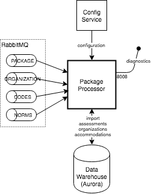

#### Configuration
The [Annotated Configuration](../config/rdw-ingest-package-processor.yml) describes the properties and their effects.

#### Deployment Spec
The default max heap size is -Xmx384m which should be fine for any environment. The off-heap is about 160MB so the container should have a memory limit of about 600M.
The [Sample Kubernetes Spec](../deploy/package-processor-service.yml) runs a single replica.


<a name="exam-processor"></a>
## Exam Processor
This processor handles parsing, validating and writing test results to the data warehouse. It also extracts student information from the test results, creating and updating them as necessary. It is horizontally scalable with each process handling 20-30 exams/sec.

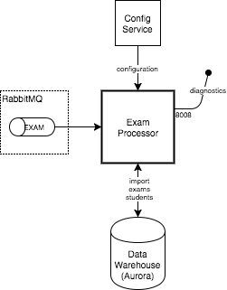

#### Configuration
The [Annotated Configuration](../config/rdw-ingest-exam-processor.yml) describes the properties and their effects.

#### Deployment Spec
The default max heap size is -Xmx384m which is more than enough and should be fine for any environment. The off-heap is about 180MB so the container should have a memory limit of about 600M.
The [Sample Kubernetes Spec](../deploy/exam-processor-service.yml) runs two replicas.


<a name="group-processor"></a>
## Group Processor
This processor handles parsing, validating and writing student group information to the data warehouse. It is horizontally scalable but a single process can handle a large volume of data (because most of the work is being done by the database itself), and group changes are relatively infrequent. Unlike other processors it must access the archive store directly (instead of getting its data from the message queue). It also uses Aurora's native ability to load directly from S3 to avoid copying data excessively.

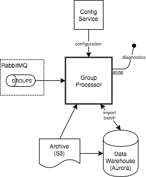

#### Configuration
The [Annotated Configuration](../config/rdw-ingest-group-processor.yml) describes the properties and their effects.

#### Deployment Spec
The default max heap size is -Xmx384m which should be fine for any environment. The off-heap is about 170MB so the container should have a memory limit of about 600M.
The [Sample Kubernetes Spec](../deploy/group-processor-service.yml) runs a single replica.


<a name="migrate-reporting"></a>
## Migrate Reporting
The migrate reporting service moves data from the warehouse to the reporting database. The service is not built to be horizontally scalable. Having more than one migrate reporting process will result in unpredictable behavior. 

Data is migrated based on import status (PROCESSED) and created/updated timestamps. The migration process is scheduled to run periodically. In each period, data is processed in small batches until there is no full batch remaining. The migration occurs in two steps, first from warehouse to staging, then from staging to reporting (the staging tables exist in the reporting database).

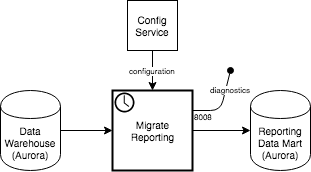

The migrate service is controlled by two conditions: the user-controlled run state and the system-generated enabled state. The status end-points can be used to see the current status and pause/resume the service. Please refer to [Troubleshooting Migrate](Troubleshooting.md#migrate) for more details.

#### Configuration
The [Annotated Configuration](../config/rdw-ingest-migrate-reporting.yml) describes the properties and their effects.
 
#### Deployment Spec
The default max heap size is -Xmx512m because this service requires more memory. If the system is configured for a larger batch size (e.g. 4000 instead of 2000), the max heap size may have to be increased. The off-heap is about 160MB so the container should have a memory limit of at least 800M.
The [Sample Kubernetes Spec](../deploy/migrate-reporting-service.yml) runs a single replica with a larger memory limit.


<a name="migrate-olap"></a>
## Migrate OLAP
The migrate OLAP service is responsible for migrating data from the data warehouse to the aggregate reporting OLAP data store. The service is not built to be horizontally scalable. Having more than one migrate olap process will result in unpredictable behavior.

Data is migrated based on import status (PROCESSED) and created/updated timestamps. The migration process is scheduled to run daily. Each time data is processed in large batches until there is no full batch remaining. The migration occurs in two steps, first from warehouse to staging, then from staging to olap (the staging tables exist in the olap database). The migration tables exist in a separate, non-OLAP database.

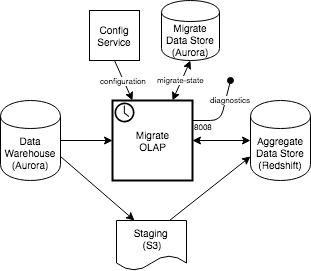

The migrate service is controlled by two conditions: the user-controlled run state and the system-generated enabled state. The status end-points can be used to see the current status and pause/resume the service.

#### Configuration
The [Annotated Configuration](../config/rdw-ingest-migrate-olap.yml) describes the properties and their effects.
 
#### Deployment Spec
The default max heap size is -Xmx384m which should be fine for any environment (unlike migrate-reporting, the migrate-olap service offloads more of the work to the database). The off-heap is about 170MB so the container should have a memory limit of about 600M.
The [Sample Kubernetes Spec](../deploy/migrate-olap-service.yml) runs a single replica.


<a name="taks-service"></a>
## Task Service
This service is responsible for executing scheduled tasks. Currently this includes:
* Synchronizing organization data from ART (daily).
* Generating an import reconciliation report (daily).
* Resubmitting unprocessed test results (daily).

Only a single instance should be run since the task execution uses a simple, uncoordinated, time-based strategy.

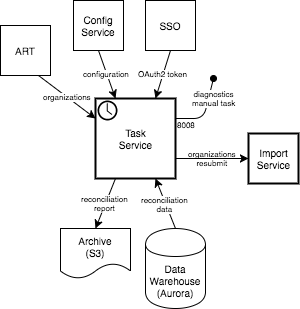

#### Configuration
The [Annotated Configuration](../config/rdw-ingest-task-service.yml) describes the properties and their effects.

#### Deployment Spec
The default max heap size is -Xmx384m which should be fine for any environment. The off-heap is about 160MB so the container should have a memory limit of about 600M.
The [Sample Kubernetes Spec](../deploy/task-service.yml) runs a single replica.


<a name="reporting-webapp"></a>
## Reporting Web App
This is the main reporting web application used by customers. It provides the UI experience for all users, including admin functionality. It is horizontally scalable with each process handling about 2000 concurrent users (this deployment is expected to have up to 15000 concurrent users).

The reporting web app is a UI-only application that handles some security (SSO redirects) and the presentation of data. All the "heavy lifting" of querying data is handled by the API services.

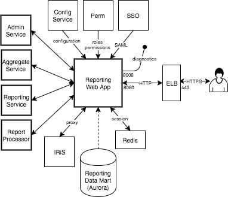

#### Configuration
The [Annotated Configuration](../config/rdw-reporting-webapp.yml) describes the properties and their effects.

#### Deployment Spec
The default max heap size is -Xmx768m which should be fine for any environment. The off-heap is about 240MB so the container should have a memory limit of about 1200M.
The [Sample Kubernetes Spec](../deploy/reporting-webapp.yml) runs four replicas with a higher memory limit.


<a name="reporting-service"></a>
## Reporting Service
This service provides the back-end API for reports against the reporting data mart, i.e. individual test results. It is horizontally scalable and many instances should be run to deal with report requests from the webapp.

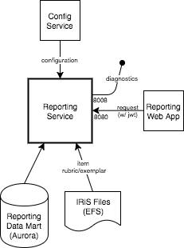

#### Configuration
The [Annotated Configuration](../config/rdw-reporting-service.yml) describes the properties and their effects.

#### Deployment Spec
The default max heap size is -Xmx384m and should be increased in all but the smallest environments. The off-heap is about 200MB so the container should have a memory limit of at least 600M.
The [Sample Kubernetes Spec](../deploy/reporting-service.yml) runs a single replica with increased heap size and memory limit.


<a name="aggregate-service"></a>
## Aggregate Service
This service provides the back-end API for reports against the OLAP data store, i.e. aggregate reports. It is horizontally scalable; however, the OLAP data store is typically the bottleneck and running many instances of this service may not result in better overall throughput.

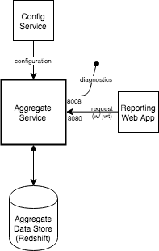

#### Configuration
The [Annotated Configuration](../config/rdw-reporting-aggregate-service.yml) describes the properties and their effects.

#### Deployment Spec
The default max heap size is -Xmx768m which should be fine for most environments, perhaps it could be lowered (no less than 600m) in small environments. The off-heap is about 240MB so the container should have a memory limit of at least 1G.
The [Sample Kubernetes Spec](../deploy/aggregate-service.yml) runs a single replica with default settings.


<a name="admin-service"></a>
## Admin Service
This service provides the back-end API for administrative functionality including management of student groups, instructional resource links, embargo settings. It is horizontally scalable, however administrative management is limited in scope and a single instance is usually sufficient.


#### Configuration
The [Annotated Configuration](../config/rdw-reporting-admin-service.yml) describes the properties and their effects.

#### Deployment Spec
The default max heap size is -Xmx384m which should be fine for most environments. The off-heap overhead is about 200MB so the container should have a memory limit of about 600M.
The [Sample Kubernetes Spec](../deploy/admin-service.yml) runs a single replica.


<a name="report-processor"></a>
## Report Processor
This processor generates reports. It is horizontally scalable and many instances should be run to deal with reporting load.

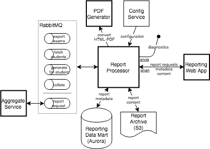

#### Configuration
The [Annotated Configuration](../config/rdw-reporting-report-processor.yml) describes the properties and their effects.

#### Deployment Spec
The default max heap size is -Xmx384m and should be increased in all but the smallest environments (very large, multi-student PDF reports may cause memory pressure). The off-heap overhead is about 240MB so the container should have a memory limit of about 650M.
The [Sample Kubernetes Spec](../deploy/report-processor-service.yml) runs two replicas with increased heap size and memory limit.


<a name="reporting-webapp"></a>
## PDF Generator
This application converts HTML to PDF. It is used by the report processor. It is horizontally scalable and many instances should be run to deal with reporting load. Note the PDF generator is not a Spring Boot application: it doesn't use the central configuration server, it doesn't have the same actuator end-points, and logging is different.

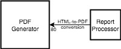

#### Configuration
There are no configuration options for the PDF generator.

#### Deployment Spec
This service is not java-based and does not support changing the heap size.
The [Sample Kubernetes Spec](../deploy/wkhtmltopdf-service.yml) runs four replicas.


## System Configuration

Once the system is deployed it is necessary to configure the system by loading subjects, assessments, accommodations, instructional resources, student groups, normative data. There are also end-user features that may be enabled or disabled.

#### Subjects
The subject XML defines a subject's attributes for the RDW system. It is the tenant's responsibility to define a subject XML based on the schema, [RDW_Subject.xsd](https://github.com/SmarterApp/RDW_Common/blob/master/model/src/main/resources/RDW_Subject.xsd). SmarterBalanced's [Math](../deploy/Math_subject.xml) and [ELA](../deploy/ELA_subject.xml) subjects XML may be found in the `deploy` folder of this project. Subjects must be loaded into the system before assessment packages. The system allows for subject updates but only for the data attributes that have not been used by the system at the time of the update.
We have also proved two additional sample subject definition XMLs as samples/templates for additional subjects: [Sample Subject](../deploy/new_subject_config.xml) and [Mini Subject.](../deploy/mini_subject_config.xml)
Loading the packages is an IT/DevOps function and requires data load permissions:
```bash
export ACCESS_TOKEN=`curl -s -X POST --data 'grant_type=password&username=rdw-ingest-opus@sbac.org&password=password&client_id=rdw&client_secret=password' 'https://sso.sbac.org/auth/oauth2/access_token?realm=/sbac' | jq -r '.access_token'`
curl -X POST --header "Authorization: Bearer ${ACCESS_TOKEN}" -F file=@Math_subject.csv https://import.sbac.org/subjects/imports
```
>NOTE: To optimize system performance, subject data is cached in the Exam Processor and Reporting services (Admin Service, Aggregate Service, Reporting Service, Report Processor, and Webapp). When subjects are loaded please do the following:
> 1. Stop all Exam Processors before ingesting a subject XML
> 2. Ingest the subject XML
> 3. Re-start the Exam Processors after the successful subject changes
> 4. Wait for migration from warehouse to reporting to complete
> 5. Re-start the Reporting services

#### Assessment Packages

The assessment packages define the tests that are administered to the students. They include performance parameters which enable the student results to be appropriately interpreted.
SmarterBalanced provides these packages; specifically, there is a `Tabulator` tool which produces a CSV file that is loaded into the warehouse. In general this will be done during the break between school years, but sometimes updates are necessary to correct data. *Note that `subject` data must be loaded before loading assessments*. Loading the packages is an IT/DevOps function and requires data load permissions:
```bash
export ACCESS_TOKEN=`curl -s -X POST --data 'grant_type=password&username=rdw-ingest-opus@sbac.org&password=password&client_id=rdw&client_secret=password' 'https://sso.sbac.org/auth/oauth2/access_token?realm=/sbac' | jq -r '.access_token'`
curl -X POST --header "Authorization: Bearer ${ACCESS_TOKEN}" -F file=@2017-2018.csv https://import.sbac.org/packages/imports
```

#### Accommodations

Accommodations describe inline and external resources that may be made available to students during testing. Loading them into the warehouse allows them to be displayed properly in student reports.
SmarterBalanced provides this [file][4]. In general this will be loaded at the same time as the assessment packages. Loading the file is an IT/DevOps function and requires data load permissions:
```bash
export ACCESS_TOKEN=`curl -s -X POST --data 'grant_type=password&username=rdw-ingest-opus@sbac.org&password=password&client_id=rdw&client_secret=password' 'https://sso.sbac.org/auth/oauth2/access_token?realm=/sbac' | jq -r '.access_token'`
curl -X POST --header "Authorization: Bearer ${ACCESS_TOKEN}" -F file=@accommodations.xml https://import.sbac.org/accommodations/imports
```

#### Instructional Resources

Instructional resources are links to content that help teachers address common core topics.
Although organization-specific resources may be configured in the system by administrative users, the SmarterBalanced "system" resources must be loaded by IT/DevOps. There is a SQL script to facilitate this; because these resources are proprietary they are not included in this public repository.
```bash
mysql -h rdw-prod-reporting-cluster.cluster-cimuvo5urx1e.us-west-2.rds.amazonaws.com -u root -p < load_instructional_resources.sql
```

#### Normative Data

Normative or percentile data allows teachers and administrators to compare their students' performance against the entire student population.
SmarterBalanced provides this data. The system must be configured to enable the viewing of percentiles, and the data must be loaded. This will be done by IT/DevOps.
To enable the feature, modify the `application.yml` configuration file (the reporting application must be restarted after this change):
```yml
reporting:
  percentile-display-enabled: true
```
Then load the [normative data](Norms.md). *Note that assessments must be loaded before normative data*.
```bash
export ACCESS_TOKEN=`curl -s -X POST --data 'grant_type=password&username=rdw-ingest-opus@sbac.org&password=password&client_id=rdw&client_secret=password' 'https://sso.sbac.org/auth/oauth2/access_token?realm=/sbac' | jq -r '.access_token'`
curl -X POST --header "Authorization: Bearer ${ACCESS_TOKEN}" -F file=@norms.csv https://import.sbac.org/norms/imports
```

#### Student Groups

Student groups provide a focused view of test results for teachers and school administrators. The system supports "assigned" groups configured by administrators and "teacher-created" groups. The teacher created groups are managed by teachers in the reporting UI but the assigned groups must be loaded into the system either in the admin section or by directly posting files to the RESTful API.
The reporting UI, including the admin section, is documented in the user guide. Posting files is described in detail in [Student Groups](StudentGroups.md).

#### Target Exclusions

Assessment items are categorized into broad "claims" and more specific "targets". The reporting UI provides target-level reporting. But not all targets have enough coverage to provide statistically significant conclusions so they are excluded from these reports (note that these exclusions are applied on top of other restrictions in the system, for example, target reports are only available for summative assessments, only claim 1 math targets are included, etc.)
Because the exclusions vary for assessments, the system allows these exclusions to be configured. This is done by IT/DevOps adding entries to a table (after modifying the table, a migration must be triggered as well).
How the assessments and targets are determined will depend on the source of the knowledge. Typically the natural ids are known, and the target's claim must be included for uniqueness, so the SQL for a single exclusion might look like:
```sql
INSERT INTO asmt_target_exclusion
  SELECT a.id AS asmt_id, t.id AS target_id FROM
    (SELECT id FROM asmt WHERE natural_id = '(SBAC)SBAC-OP-G5E-2017-COMBINED-Spring-2017-2018') a
    JOIN
    (SELECT t.id FROM target t JOIN claim c ON t.claim_id = c.id WHERE c.code = '1-LT' AND t.natural_id = '5-4') t

-- trigger migration
INSERT INTO import(status, content, contentType, digest)
  SELECT 1, ic.id, 'target exclusions', left(uuid(), 8) from import_content ic where name = 'PACKAGE';
```

#### Transfer Enabled

The system controls visibility of students and their test results based on permissions granted at the institution level. For example, a teacher may have PII group permissions to see test results for their class given at their school. There is an optional feature that allows users to see test results for their students that were administered at another institution. By default this feature is disabled. To enable it, IT/DevOps may add the following property to the `application.yml` configuration file:
```yml
reporting:
  transfer-access-enabled: true
```
Any time a configuration option is changed, the affected services must be restarted. For the transfer enabled flag, restart the `report-processor` instances.

#### English Learners

There are different systems for categorizing english learners. The system supports two of them, Limited English Proficiency (LEP) and English Language Acquisition Status (ELAS). Only one should be used, the default is ELAS; this should correspond to the other systems in the testing ecosystem, especially the test delivery system. To switch to use LEP, IT/DevOps may change the following property in the `application.yml` configuration file:
```yml
reporting:
  english-learners:
    - lep
```
This setting is used by all the reporting services so they should be restarted: `aggregate-service`, `report-processor`, `reporting-service`, `reporting-webapp`.

## Embargo

Embargo is a feature where summative test results are held back until all the data is available and validated. An embargo affects the viewing of individual test results separately from aggregate report data. Lifting the embargo releases test results.

When individual test results are embargoed, those results will not be visible in the reporting UI to normal users. Similarly, when aggregate test results are embargoed, those reports will not be visible in the aggregate reporting UI to normal users. Embargo administrators will be able to see the results (and the UI will have a notice to that effect) regardless of embargo settings.

Embargo is set at the state and district levels. Districts may release test results while the state is still embargoed. However, once a state releases test results (i.e. lifts the embargo), all results for all districts are released, regardless of the district embargo settings.

Embargo settings are managed in the Admin UI. The functionality will be available if a user has embargo write permissions for the state or districts.

#### Import and Migrate
As discussed in the [Import and Migrate](Runbook.migrate.md) the embargo setting is migrated as part of the general ingest process. Although not recommended, it is possible to manually modify embargo settings. For example, to lift the statewide embargo on individual test results for the school year 2018, then trigger the migration:
```sql
UPDATE state_embargo SET individual=0 WHERE school_year=2018;
INSERT INTO import (status, content, contentType, digest) VALUES (1, 6, 'lift embargo', 'lift embargo 2017-12-12');
```


---
[1]: https://docs.spring.io/spring-boot/docs/1.5.2.RELEASE/reference/htmlsingle/#boot-features-external-config
[2]: https://docs.spring.io/spring-boot/docs/1.5.2.RELEASE/reference/htmlsingle/#common-application-properties
[3]: https://docs.spring.io/spring-boot/docs/1.5.2.RELEASE/reference/htmlsingle/#production-ready-endpoints
[4]: https://github.com/SmarterApp/AccessibilityAccommodationConfigurations/blob/master/AccessibilityConfig.xml
 

			 
